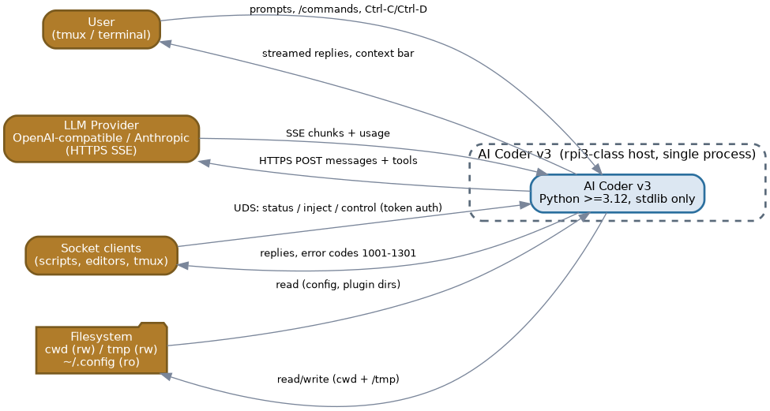
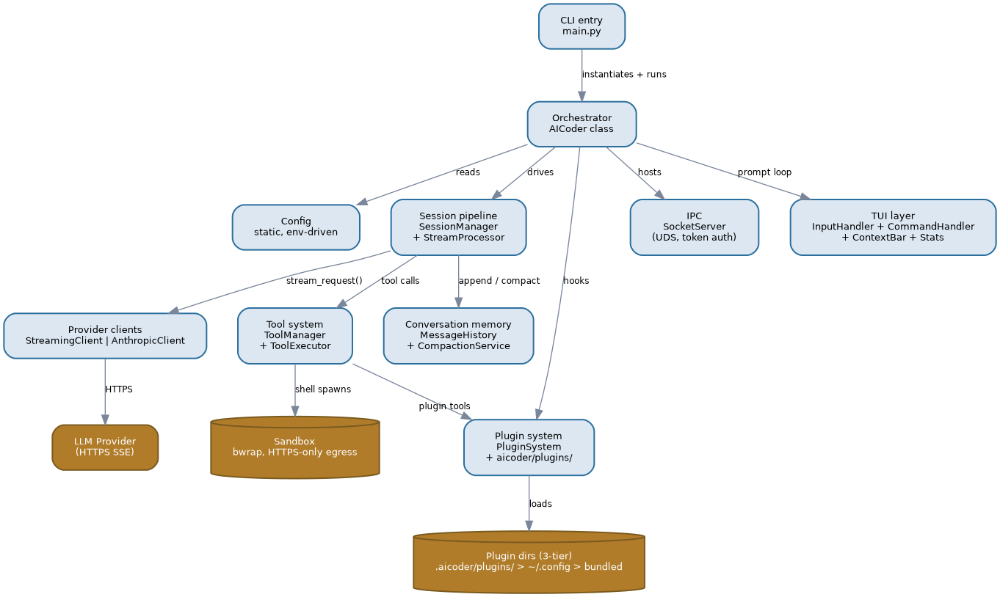
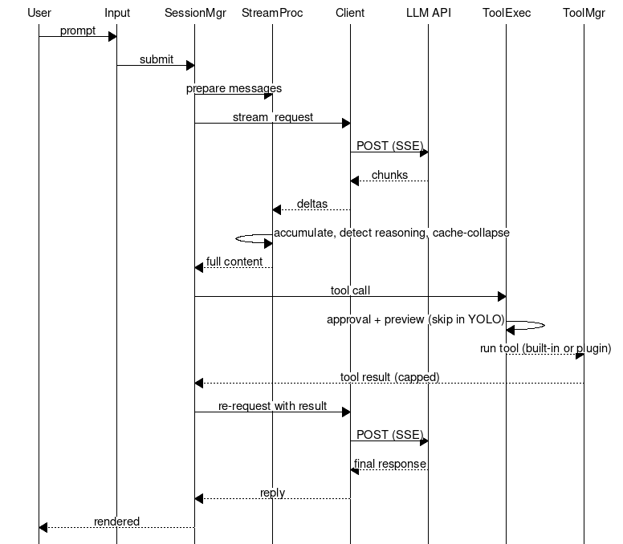
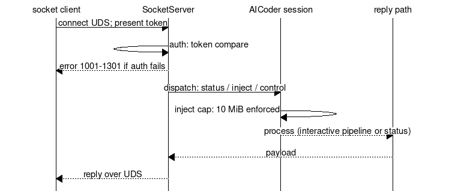
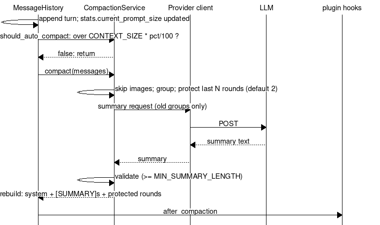
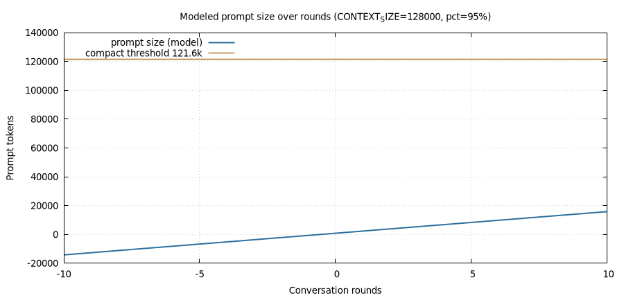

# Document Control

| Field     | Value                                             |
|-----------|---------------------------------------------------|
| Document  | System Architecture - AI Coder v3 (package v2.0.0)|
| Version   | 1.0                                               |
| Status    | Draft (markdown source of truth; renders from `make all`) |
| Date      | 2026-08-30                                        |
| Owner     | AI Coder v3 maintainers                           |
| Reviewers | -                                                 |
| Approver  | -                                                 |
| Sources   | `main.py`, `aicoder/core/*`, `pyproject.toml`, `README.md`, `AGENTS.md` |
| Toolchain | pandoc + weasyprint + graphviz + mscgen + gnuplot (docs-as-code) |

> Component names and line counts in this document were verified against the
> codebase on 2026-08-30. ADR statuses are inferred from the implementation;
> no authoritative ADR files exist in the repo yet (see section 7).

# 1. Executive Summary

AI Coder v3 is a terminal-based, single-process AI coding assistant that runs
entirely on **Python 3.12+ standard library** (zero external runtime
dependencies, verified in `pyproject.toml`).

Key numbers:

- **0** runtime dependencies; Apache-2.0 licensed; console script
  `aicoder-v3 = main:main`.
- **1** process hosts the whole system: ~15 core modules orchestrated by
  `AICoder` (504 lines) with a static `Config` class (1,142 lines) driving
  behavior from environment variables.
- **2** interchangeable LLM provider clients behind one generator interface
  (`StreamingClient` for OpenAI-compatible endpoints, `AnthropicClient` for
  the Anthropic-compatible endpoint; selected by `API_PROVIDER=enviro`).
- **6** built-in tools (`read_file`, `write_file`, `edit_file`,
  `run_shell_command`, `grep`, `list_directory`) plus plugin-provided tools
  (`bg_jobs`, `ask_user`, `web_search`, `get_url_content`, `read_image`).
- **~50** plugins loaded from a 3-tier directory priority system; 30+ slash
  commands; hook-based extension points.
- **1** Unix-domain-socket IPC server (token-authenticated, mpv-inspired) for
  external control, inject, and status.
- **1** compaction engine: sliding-window conversation pruning with AI
  summarization (default context 128,000 tokens, auto-compact at 95%).

Design intent: keep the interactive loop fast on resource-constrained hosts
(Raspberry Pi 3-class hardware), keep the tool surface auditable (approval
gating, allow/deny filters, sandboxed shell), and keep every behavior
configurable from the environment without a config file format of its own.

# 2. Scope & Goals

## In scope

- Structural architecture: entry point, orchestrator, session pipeline,
  tool system, plugin system, IPC, compaction, provider abstraction.
- Key flows: interactive prompt, piped/YOLO mode, socket control, compaction.
- Non-functional requirements and known risks for the current implementation.

## Out of scope

- Per-plugin internal design (covered by plugin source + memory notes).
- Line-by-line API documentation (see `docs/SOCKET_API.md`, docs in `docs/`).
- Deployment/ops runbooks; VM/container packaging.

## Goals

- **Zero-dependency**: stdlib-only, trivially runnable via `uv venv` + pip.
- **Extensible**: plugins, hooks, and commands without core changes.
- **Safe**: approvals, allow/deny filters, sandboxed shell execution.
- **Self-aware**: compaction, caching (cache-hit tracking), cost tracking,
  stats logging.
- **Controllable**: external IPC for editors/scripts/tmux automation.

# 3. System Context (C4 L1)



| Element      | Role                                                                 |
|--------------|----------------------------------------------------------------------|
| User         | Human in `tmux`/terminal, drives interactive prompts and slash commands |
| AI Coder v3  | The system under analysis (single process on the rpi3-class host)    |
| LLM provider | OpenAI-compatible or Anthropic-compatible HTTPS API (streaming SSE)  |
| Socket clients | Scripts, editors, tmux automation talking over the Unix socket     |
| Filesystem   | Project cwd (writable), `/tmp` (writable), `~/.config` (read-only), plugin dirs, session/stats logs |

External interactions:

- User -> system: typed prompts, `/commands`, `Ctrl-C`/`Ctrl-D`, tmux control.
- System -> LLM provider: HTTPS POST with messages + tool definitions; streamed
  SSE responses with usage; exponential-backoff retry loops.
- Socket clients -> system: token-authenticated UDS commands (status, inject,
  control; 10 MiB inject cap).
- System -> filesystem: reads/writes under cwd and `/tmp`; sandboxed shell
  spawns have HTTPS-only egress (nftables allowlist).

# 4. Container View (C4 L2)



The `AICoder` process decomposes into these containers:

| Container      | Module(s)                       | Responsibility |
|----------------|---------------------------------|----------------|
| CLI entry      | `main.py`                       | Sets `AICODER_START_TIME`, instantiates `AICoder()`, starts the loop |
| Orchestrator   | `aicoder/core/aicoder.py`       | Wires all components; interactive/piped/socket-only modes; signal handling (SIGTERM/SIGHUP); auto-save |
| Config         | `aicoder/core/config.py`        | Static class; all behavior from env vars (YOLO_MODE, SANDBOX, THINKING, REASONING_EFFORT, retries/backoff, context size, thresholds) |
| Session pipeline | `session_manager.py`, `stream_processor.py` | `process_with_ai`: prepare -> stream -> validate tool calls -> post-process; recursive tool-call loop; reasoning-field detection; cache-collapse; liveness spinner |
| Provider clients | `streaming_client.py`, `anthropic_client.py` | Uniform `stream_request(...)` generator; SSE + non-streaming; backoff retries; usage hooks |
| Tool system    | `tool_manager.py`, `tool_executor.py` | Tool defs for the API; allow/deny filtering; approval + preview flow; guidance mode; post-result hooks |
| Plugin system  | `plugin_system.py` + `aicoder/plugins/` | 3-tier loading, duck-typed `create_plugin(ctx)`, register_tool/command/hook/completer, allow/deny filters |
| Conversation memory | `message_history.py`, `compaction_service.py` | Message store; sliding-window AI summarization; auto-compact trigger; `after_compaction` hook |
| IPC            | `socket_server.py`             | UDS server; token auth; fixed path via `AICODER_SOCKET_IPC_FILE`; error codes 1001-1301 |
| TUI layer      | `input_handler.py`, `command_handler.py`, `context_bar.py`, `stats.py` | Prompt input, 30+ slash commands, context/cost bar, request stats |

Key points:

- **Provider swap is a module import, not an interface layer**: `aicoder.py`
  picks `AnthropicClient` vs `StreamingClient` from `API_PROVIDER`; both expose
  the same generator. `anthropic_client.py` intentionally duplicates core
  logic ("core must stay stable" - source comment).
- **Single source of truth for behavior is the environment**: `Config` is
  static and env-driven; no config files, no TOML/YAML.
- **Conversation memory is two-tier**: `MessageHistory` stores; 
  `CompactionService` summarizes; dedup/caching plugins (`cache_compact`,
  `tools_compact`) handle the bookkeeping mechanics.
- **Extension surface is hooks**, e.g. `on_context_bar`,
  `after_usage_data`, `on_api_error`, `before_api_request`,
  `on_empty_ai_response`, `after_compaction`, `on_stats`,
  `on_stats_entry`.
- **Shell execution is sandboxed** (`/sec` plugin spawns AI shell commands in
  nested bwrap with HTTPS-only egress allowlist).
- **Plugins ship tools** (`bg_jobs`, `ask_user`, `web_search`,
  `get_url_content`, `read_image`) and are filtered by
  `TOOLS_ALLOW`/`TOOLS_DENY`/`PLUGINS_ALLOW`/`PLUGINS_DENY`.

# 5. Key Flows

## 5.1 Interactive prompt with tool loop



```msc
# rendered from diagrams/key-flow-interactive.msc
```

| Step | Actor        | Action |
|------|--------------|--------|
| 1    | User         | Types prompt in `InputHandler` |
| 2    | SessionManager | `_prepare_for_processing` builds messages |
| 3    | StreamingClient | POST to LLM provider (streaming, tools attached) |
| 4    | StreamProcessor | Accumulates chunks; detects reasoning fields; collapses for cache; spinner |
| 5    | SessionManager | `_validate_and_process_tool_calls`; on tool call -> exec |
| 6    | ToolExecutor  | Approval prompt + preview (skipped in YOLO mode or by allow-list) |
| 7    | ToolManager   | Runs built-in or plugin tool; result capped (`MAX_TOOL_RESULT_SIZE=20000`) |
| 8    | SessionManager | Feeds tool result back into the loop; repeats until no tool calls |
| 9    | User          | Final response rendered |

### Failure modes (interactive)

| Failure | Detection | Response |
|---------|-----------|----------|
| API error / 5xx / timeout | `on_api_error` hook | Exponential backoff retry (`2^(attempt+1)` capped at `effective_max_backoff()`) |
| Empty AI response | empty content detected | `on_empty_ai_response` hook; `empty-retry` plugin re-injects (loop-guarded) |
| Tool validation error | `_validate_and_process_tool_calls` | Converted to a user message back to the model |
| Tool approval denied | ToolExecutor | Call skipped; model informed via result message |
| Provider returns non-SSE shape | StreamProcessor field detection | Falls back to non-streaming path |
| Ctrl-C / Ctrl-D | signal handlers, EOF | Graceful interrupt; session resumed |

## 5.2 Piped / YOLO mode

- `main.py` reads stdin via `read_stdin_as_string`; non-interactive (piped)
  mode processes the piped input and exits.
- `YOLO_MODE=1` bypasses tool-approval prompts (guidance mode); approvals
  skipped per allow-list.

## 5.3 Socket control



| Step | Actor         | Action |
|------|---------------|--------|
| 1    | Socket client | Connects to UDS path (`AICODER_SOCKET_IPC_FILE`); presents token |
| 2    | SocketServer  | Authenticates (token compare); dispatch (error codes 1001-1301) |
| 3    | Session       | Injects/controls/status; 10 MiB inject cap enforced |
| 4    | SocketServer  | Reply over UDS |

### Failure modes (socket)

| Failure | Detection | Response |
|---------|-----------|----------|
| Bad/missing token | auth mismatch | Error code (1001 range) |
| Oversized inject | size check | Reject (10 MiB cap) |
| Busy session | in-processing flag | Busy status / queue (see memory: remote-busy-status) |

## 5.4 Compaction



| Step | Actor             | Action |
|------|-------------------|--------|
| 1    | MessageHistory    | Appends turn; `should_auto_compact()`: `stats.current_prompt_size > CONTEXT_SIZE * CONTEXT_COMPACT_PERCENTAGE/100` |
| 2    | CompactionService | Groups messages; protects last `COMPACT_PROTECT_ROUNDS` (default 2) rounds |
| 3    | CompactionService | Requests AI summary of old groups (`_get_ai_summary`) |
| 4    | CompactionService | Validates summary (length >= `MIN_SUMMARY_LENGTH`=100); on failure skips compaction safely |
| 5    | MessageHistory    | Rebuilds: system + prior `[SUMMARY]`s + new summary + protected recent rounds |
| 6    | -                 | `after_compaction` hook fires (plugins: cache_hit reset, ai_cost session stats) |

### Failure modes (compaction)

| Failure | Detection | Response |
|---------|-----------|----------|
| Summary validation fails | `summary is None` / too short | Compaction skipped; conversation intact |
| Summary loss in rendering (historical) | memory: compaction-msg-loss | Summary must be visible reply text; whitespace-prefix convention; miss is safe (nudge re-injects) |
| Image-containing messages | `_has_image_content` | Excluded from compaction groups |
| Double-compact | `cont_prompt` guard + `after_compaction` hook | Refused + junk dropped (cache-compact mechanics) |

# 6. Capacity & Growth

Single-user tool; the binding constraint is LLM context, not local hardware.
Auto-compaction theoretically bounds prompt size at
`CONTEXT_SIZE * CONTEXT_COMPACT_PERCENTAGE` = **128,000 * 95% = 121,600 tokens**.



Modeled sawtooth (assumed ~1,500 tokens/turn, ~700-token summary; **model
only, not measured** — see Risks R-2):

- Round 0-80: prompt grows to the 121.6k threshold.
- Round ~81: compaction collapses history to summary + 2 protected rounds
  (~3.6k), then growth resumes.
- Practical ceiling: 1 prompt + ~80 full turns per cycle on the default
  128k context.

Sizing consequence: because compaction is prompt-size driven and the AI
summary replaces the oldest groups wholesale, long sessions degrade into
summary-only memory for everything older than 2 rounds — the "self-contained,
actionable" summary prompt (compaction_service L317) is the quality
bottleneck, not raw capacity.

# 7. ADR Summary

Inferred from implementation; statuses are observations, not decisions made
in an ADR process.

| ID    | Decision | Rationale | Status |
|-------|----------|-----------|--------|
| ADR-1 | Stdlib-only, zero runtime deps | Repo vetted; supply-chain and build risk none | Adopted (pyproject.toml) |
| ADR-2 | Unix-socket IPC (mpv-inspired) over HTTP | No port/exposed surface; local control only | Adopted (socket_server.py) |
| ADR-3 | Duck-typed `create_plugin(ctx)` over entry-point packages | Simplest load contract; 3-tier dirs | Adopted (plugin_system.py) |
| ADR-4 | Env-driven static Config (no config file) | Trivial deployment; tmux/env integration | Adopted (config.py) |
| ADR-5 | AI summarization compaction over truncation | Preserves context; sliding window + protect rounds | Adopted (compaction_service.py) |
| ADR-6 | Tool approval + preview gating with YOLO override | Auditability vs speed; user can opt out | Adopted (tool_executor.py) |
| ADR-7 | Two provider clients with duplicated core (no shared base) | "Core must stay stable"; avoids refactor risk of streaming_client | Adopted (anthropic_client.py header comment) |
| ADR-8 | Token auth on UDS + fixed socket file path | Local trust boundary; deterministic path for tooling | Adopted (socket_server.py) |
| ADR-9 | Multi-field reasoning detection + dedup | Providers differ in field names (`reasoning_content`/`reasoning`/`reasoning_text`) | Adopted (stream_processor.py; docs/REASONING_CAPTURE.md) |

# 8. Non-Functional Requirements

| ID    | Requirement | Target |
|-------|-------------|--------|
| NFR-1 | Runtime dependencies | 0 (stdlib only) |
| NFR-2 | Interpreters | Python >= 3.12 |
| NFR-3 | Startup | No network I/O at startup (local load only); interactive prompt in <2s on rpi3-class host *(design intent, not measured — see R-2)* |
| NFR-4 | Sandbox | AI-triggered shells in bwrap; HTTPS-only egress allowlist; writable = cwd + /tmp only |
| NFR-5 | Tool safety | Approval gating by default; `TOOLS_ALLOW`/`TOOLS_DENY` filters server-side |
| NFR-6 | Availability | Backoff retries on provider failure; compaction failures safe-skip; empty-response self-heal hooks |
| NFR-7 | Context bound | Prompt capped at CONTEXT_SIZE * percentage (default 121.6k) |
| NFR-8 | Compatibility | Two provider transports behind one generator interface |
| NFR-9 | Extensibility | Plugins/hooks/commands without core edits |
| NFR-10 | Observability | Stats log (per-request), central stats socket, cache-hit, session cost (plugins) |

# 9. Risks & Mitigations

| ID | Risk | Impact | Mitigation |
|----|------|--------|------------|
| R-1 | Provider SSE/field drift (reasoning fields, cache fields) | Broken/duplicated reasoning, wrong cost math | Multi-field detection + dedup; heuristic field-based anthropic detection (memory: ai_cost) |
| R-2 | Performance targets unverified on rpi3 | NFR-3 may not hold | Document as intent; measure on target hardware before claiming |
| R-3 | Compaction summary quality/loss (historical incidents) | Lost user messages, empty-retry loops | Visible-reply summary convention, whitespace-prefix tag, loop guard, `after_compaction` hook (memory: compaction-msg-loss, empty-retry-dedup) |
| R-4 | Plugin trust (arbitrary code via `create_plugin`) | Malicious plugin runs in-process | 3-tier priority, allow/deny filters, plugin dirs user-controlled; plugins audited (repo-internal) |
| R-5 | Sandbox escape via user-driven tooling (historical: git pager in cwd) | Host code execution | Seal = processes; `.bashrc` git wrapper; residual residual risk on make/pytest/npm by design (memory: sandbox-hardening) |
| R-6 | Central stats log pollution by tests/hooks | Fake cost/usage entries in shared log | Hermetic test rule: `STATS_FALLBACK_FILE=0` + patched `_write_to_central` (memory: CENTRAL LOG POLLUTION INCIDENT) |
| R-7 | Config sprawl (1,142-line static class, env vars) | Undocumented knobs, drift | README env table; this doc; memory index |
| R-8 | ADR drift (no authoritative ADRs) | Decisions undocumented | This section; promote to real ADR files when feature set stabilizes |

# 10. Glossary

| Term | Meaning |
|------|---------|
| UDS | Unix domain socket - local IPC endpoint (mpv-inspired) |
| SSE | Server-Sent Events - streaming HTTP response used by LLM providers |
| YOLO mode | `YOLO_MODE=1` - bypass tool-approval prompts (guidance/allow-list) |
| Context bar | One-line session status (cache %, cost, stats) rendered by `ContextBar` + plugin hooks |
| Compaction | Sliding-window pruning of old messages replaced by an AI-generated `[SUMMARY]` |
| Protect rounds | `COMPACT_PROTECT_ROUNDS` (default 2) newest rounds never compacted |
| Allow/deny filter | Env-driven lists restricting tools/plugins (`TOOLS_ALLOW`, `TOOLS_DENY`, `PLUGINS_ALLOW`, `PLUGINS_DENY`) |
| bwrap | bubblewrap - sandbox used for AI-triggered shell commands |
| 3-tier plugin priority | `.aicoder/plugins/` > `~/.config/aicoder-v3/plugins/` > bundled `aicoder/plugins/` |
| Reasoning fields | Provider-specific stream fields for model "thinking" (`reasoning_content`, `reasoning`, `reasoning_text`) |
| nftables allowlist | HTTPS-only egress rule set for the sandbox network namespace |